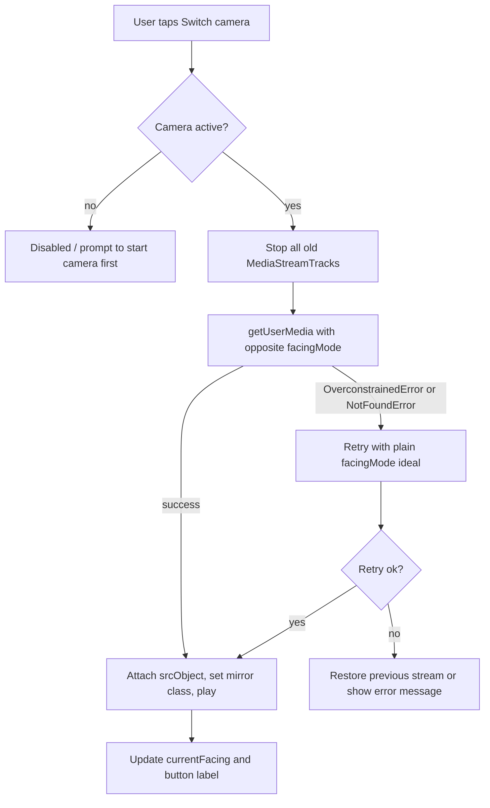

# Feature Design — Camera Direction Switch Button (front / rear)

Status: DESIGN ONLY (no code changed). Target: enable the user to switch the wound-detection
camera between the rear camera and the front camera.

## 1. Current implementation summary

The live camera is the **browser `navigator.mediaDevices.getUserMedia` API**, NOT the ESP32.
Confirmed by a full-repo search: `getUserMedia` / `mediaDevices` / `srcObject` appear ONLY in
[`js/wound-detect.js`](js/wound-detect.js:252). The ESP32 client
[`js/devices/esp32-client.js`](js/devices/esp32-client.js:196) only issues `no-cors` motor
commands (`m1/fwd`, `m2/fwd`, `m3/fwd`); [`js/devices/frames.js`](js/devices/frames.js:50) is
the BLE thermometer frame parser (unrelated to video). There is **no ESP32 video/frame-mjpeg
endpoint** anywhere in the client.

Key locations:

- Module-level stream state: [`js/wound-detect.js`](js/wound-detect.js:29) — `let videoStream = null;`
- DOM lookup + init guard: [`js/wound-detect.js`](js/wound-detect.js:227-237)
- Start/re-start camera handler: [`js/wound-detect.js`](js/wound-detect.js:240-271)
  - stops old tracks: [`js/wound-detect.js`](js/wound-detect.js:248-250)
  - **the line where facingMode is set**: [`js/wound-detect.js`](js/wound-detect.js:252-259)
    — `facingMode: { ideal: "environment" }`, `width/height ideal 640x480`, `audio: false`
  - attach: [`js/wound-detect.js`](js/wound-detect.js:261) — `video.srcObject = videoStream;`
  - success label flip: [`js/wound-detect.js`](js/wound-detect.js:262-265)
- Capture/analysis: [`js/wound-detect.js`](js/wound-detect.js:274-284) — canvas sized from
  `video.videoWidth/videoHeight` each click, so orientation changes are already handled.
- Bootstrapped from [`js/app.js`](js/app.js:78) — `initWoundDetection();` (no arguments).

Wound view markup (view 4): [`index.html`](index.html:181-214)

- video/canvas/overlay container: [`index.html`](index.html:190-194) (`#woundVideo`,
  `#woundCanvas`, `#scanOverlay`)
- status line: [`index.html`](index.html:196) (`#woundStatusText`)
- button row: [`index.html`](index.html:198-201) — `#btnStartCamera` (`class="btn btn-blue"`)
  and `#btnCaptureAnalyze` (`class="btn btn-green"`, `disabled`)

Button/CSS conventions ([`css/components.css`](css/components.css:13)): `.btn` base (column
flex, full tap target), variants `.btn-blue`, `.btn-green`, `.btn-gray`, `.btn-outline`,
`.btn-primary`, `.btn-danger`; layout helpers `.btn-row`, `.btn-grid`; spacing helpers
`.my-4`, `.w-full` in [`css/utilities.css`](css/utilities.css:49). Note the wound section still
uses inline styles, unlike the rest of the app.

i18n: catalogue [`js/i18n/strings.js`](js/i18n/strings.js:57) with 4 locales —
`zh-Hant` (default), `zh-Hans`, `en`, `pt`; runtime `t()` in
[`js/i18n/index.js`](js/i18n/index.js:93). HTML nodes use `data-i18n` / `data-i18n-attr`
(rendered by [`js/i18n/index.js`](js/i18n/index.js:161)); language changes emit
`I18N_CHANGED` ([`js/i18n/index.js`](js/i18n/index.js:137)). Wound view uses legacy keys
`woundTitle`, `woundSubtitle`; the existing camera buttons are hard-coded Chinese (not yet
localised).

## 2. Recommended approach

**Switch via browser `facingMode` re-acquisition.** Rationale: the only video source is
`getUserMedia`; the ESP32 has no camera API, so a device command is impossible with the current
client. `facingMode` is the standard, cross-browser mechanism, and `enumerateDevices()` lets us
disable the control when fewer than two cameras exist.

High level flow:



## 3. Files to create / modify

1. **`index.html`** — add the switch button element inside the wound view.
2. **`js/wound-detect.js`** — refactor the start handler into a reusable `startCamera(facing)`,
   add switch handling, `currentFacing` state, mirroring, and capability detection.
3. **`js/i18n/strings.js`** — add new keys to all 4 locales (zh-Hant, zh-Hans, en, pt).
4. **`css/components.css`** — add a mirroring utility class and (optionally) a switch-row
   helper, following existing token usage.

No new JS module is required; keep the feature self-contained in `wound-detect.js`.

## 4. HTML structure

Insert a dedicated row immediately AFTER the existing button row
([`index.html`](index.html:201)) and BEFORE the `#woundStatusText` (or directly after it),
using the app's class conventions instead of inline styles:

```html
<div class="btn-row camera-switch-row">
  <button type="button" class="btn btn-outline" id="btnSwitchCamera"
          data-i18n="wound.camera.switch" disabled>
    🔄 切換前後鏡頭
  </button>
</div>
```

- `disabled` initially (mirrors `#btnCaptureAnalyze`) and becomes enabled once a stream starts.
- Keep it a normal visible button (not hidden) so the affordance is discoverable; JS will
  disable it when the device exposes only one camera.
- The parent row uses `.btn-row` (flex-wrap) so it degrades gracefully on narrow screens.

## 5. JS logic outline (`js/wound-detect.js`)

- Add module state: `let currentFacing = 'environment';` next to `videoStream`
  ([`js/wound-detect.js`](js/wound-detect.js:29)).
- Optionally import the shared i18n instance for labels/toasts:
  `import { i18n } from './i18n/index.js';` (this module currently imports only `getConfig`).
- Factor the `#btnStartCamera` body into a reusable async helper, e.g.:

```js
async function startCamera(facing) {
  // stop old tracks first (already done today at lines 248-250)
  // videoStream = await navigator.mediaDevices.getUserMedia({
  //   video: { facingMode: { ideal: facing }, width: { ideal: 640 }, height: { ideal: 480 } },
  //   audio: false });
  // video.srcObject = videoStream; await video.play().catch(() => {});
  // video.classList.toggle('is-mirrored', facing === 'user');
  // currentFacing = facing;
}
```

- `#btnStartCamera` handler calls `startCamera(currentFacing)` (default `'environment'`),
  preserving current behaviour and messages.
- New `#btnSwitchCamera` handler:
  1. guard `if (!videoStream) return;`
  2. compute `next = currentFacing === 'environment' ? 'user' : 'environment';`
  3. disable the button (and `#btnCaptureAnalyze`) while re-acquiring, show a
     "switching…" status;
  4. `try { await startCamera(next); }` and on
     `OverconstrainedError` / `NotFoundError` retry once with `{ facingMode: next }`
     (no `exact`); on failure attempt to restore the previous facing and surface an error
     status; `finally` re-enable.
- Capability detection on init: `navigator.mediaDevices.enumerateDevices()` → count
  `kind === 'videoinput'`; if `< 2` set `#btnSwitchCamera.disabled = true` and its title to a
  localized "only one camera" hint. Guard for `mediaDevices` being undefined.
- Subscribe to `I18N_CHANGED` (if i18n is imported) to refresh any dynamically set label/title;
  static `data-i18n` nodes are re-rendered automatically by the i18n runtime.

## 6. CSS needs (`css/components.css`)

- Front-camera preview mirroring (selfie view). Apply to the video only; the capture canvas is
  drawn from raw pixels and stays un-mirrored, which is correct for wound analysis:

```css
#woundVideo.is-mirrored,
.wound-video.is-mirrored {
  transform: scaleX(-1);
}
```

- Optional `.camera-switch-row` to centre the row
  (`display: flex; justify-content: center; margin: var(--space-5) 0;`), reusing existing
  spacing tokens rather than the inline styles used elsewhere in this section.

## 7. i18n string keys and values

Add to all four locale blocks in [`js/i18n/strings.js`](js/i18n/strings.js:57).

| Key | zh-Hant | zh-Hans | en | pt |
|-----|---------|---------|-----|-----|
| `wound.camera.switch` | 切換前後鏡頭 | 切换前后摄像头 | Switch camera | Alternar câmara |
| `wound.camera.switchToFront` | 切換至前置鏡頭 | 切换至前置摄像头 | Switch to front camera | Mudar para câmara frontal |
| `wound.camera.switchToBack` | 切換至後置鏡頭 | 切换至后置摄像头 | Switch to back camera | Mudar para câmara traseira |
| `wound.camera.switching` | 正在切換鏡頭… | 正在切换摄像头… | Switching camera… | A alternar câmara… |
| `wound.camera.single` | 此裝置僅有一個鏡頭 | 此设备仅有一个摄像头 | Only one camera available | Apenas uma câmara disponível |
| `wound.camera.error` | 無法切換鏡頭，請重試 | 无法切换摄像头，请重试 | Could not switch camera, please retry | Não foi possível alternar a câmara |

Usage:
- `data-i18n="wound.camera.switch"` sets the static label.
- `wound.camera.switchToFront` / `switchToBack` are used for the button `title` / `aria-label`
  describing the next action.
- `wound.camera.switching`, `wound.camera.single`, `wound.camera.error` feed
  `#woundStatusText` / button `title`.
- Existing `#btnStartCamera` / `#btnCaptureAnalyze` labels remain hard-coded Chinese (out of
  scope); optionally they can be localised later for consistency.

## 8. Edge cases and risks

1. **Re-acquisition**: the old `MediaStreamTrack`s must be stopped BEFORE requesting the new
   stream; some devices otherwise reject/ignore the second request or return the same camera.
2. **`exact` vs `ideal`**: `{ exact: 'environment' }` throws `OverconstrainedError` on
   desktops/laptops; use `{ ideal }` and verify the result via
   `track.getSettings().facingMode`. Retry logic must handle `NotFoundError` too.
3. **Permission prompts / iOS Safari**: switching may re-trigger permission UI on first use;
   Safari sometimes needs `video.srcObject` reassignment plus an explicit `video.play()`.
4. **Mirroring**: most browsers do NOT auto-mirror `getUserMedia` output; a front-camera
   preview normally looks mirrored to the user. Mirror only the `<video>` via CSS. The capture
   canvas is un-mirrored (raw), so detection boxes align with real anatomy but the on-screen
   preview appears flipped — acceptable; if undesired, drop the mirror class entirely.
5. **Single-camera devices**: `enumerateDevices()` `< 2` video inputs → disable the button with
   the `wound.camera.single` hint. `mediaDevices` may be undefined in insecure contexts.
6. **Button state**: disable during acquisition to prevent double-taps; re-enable in `finally`.
   Keep `#btnCaptureAnalyze` disabled until a stream is attached (existing behaviour).
7. **Failure recovery**: if the new facing fails after the old stream was stopped, attempt to
   restart the previous facing so the user is not left with a dead preview.
8. **Canvas sizing**: already re-reads `video.videoWidth/videoHeight` per capture, so switching
   camera/orientation needs no change to the analysis path.
9. **i18n timing**: `#btnSwitchCamera` exists in static HTML, so `data-i18n` renders on
   `applyToDOM()`; dynamic `title`/`aria-label` must be refreshed on `I18N_CHANGED`.
10. **Scope/regression**: `initWoundDetection()` takes no arguments; adding an i18n import is
    safe (the shared instance auto-applies). Do not touch ESP32 motor code.

## 9. Out of scope

- No ESP32-side camera switching (no such endpoint exists).
- No changes to the wound AI request/relay pipeline
  ([`relay/render/server.js`](relay/render/server.js:1)) or BLE thermometer code.
