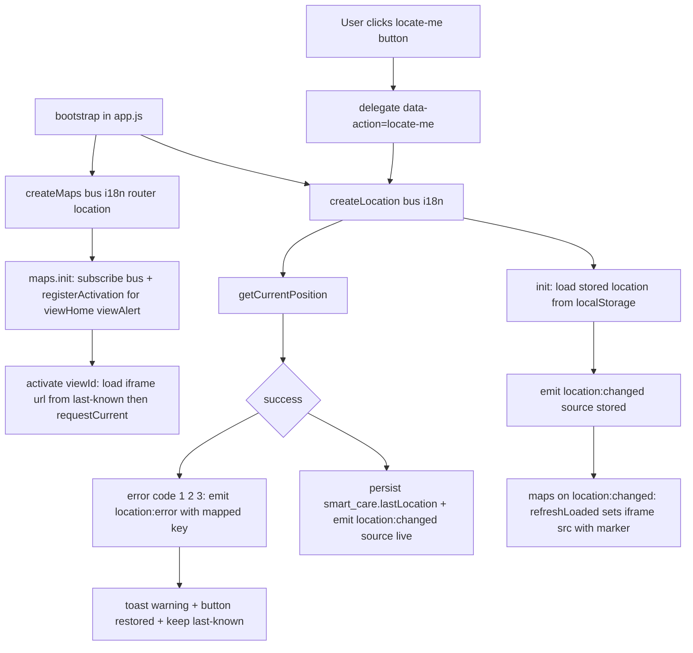

# "Show My Recent Location" — Implementation Plan

Feature: use the browser Geolocation API to obtain the user's position, show it as a
marker on the app's existing map, persist the last known location so it renders
immediately on reload, and handle errors with a clear "locate me" affordance.

Scope of this document: research + plan only. No code was modified.

---

## 1. Investigation summary (what actually exists)

### 1.1 The "map" is a Google Maps **iframe embed**, not a JS map library
- There is **no Leaflet / Mapbox / Google Maps JS API / canvas map** anywhere in the repo.
- The app embeds Google Maps via `<iframe>` with an empty `src` that is filled in lazily:
  - Home: `#homeMapFrame` at [`index.html`](index.html:117)
  - Alert: `#alertMapFrame` at [`index.html`](index.html:171)
- Both iframes are wrapped in `<div class="map-box">` ([`index.html`](index.html:116), [`index.html`](index.html:170)).
- URL template (preserved verbatim) is built by [`buildMapUrl()`](js/ui/maps.js:33):

```
https://maps.google.com/maps?q=<encoded q>&ll=<lat>,<lng>&z=14&output=embed
https://maps.google.com/maps?q=<encoded q>&output=embed            // no-coords fallback
```

- **Critical marker finding:** the `&ll=` parameter only **centers** the map — it does
  **not** drop a pin. The only way to make the keyless embed show a pin is via the
  **`q=`** parameter. `q=22.19,113.54` renders a pin at that coordinate; `q=醫院+診所`
  renders facility search results. **A keyless embed iframe can display only ONE
  pin** (the `q` location). This constraint drives the design in §4/§5.

### 1.2 Existing geolocation code already lives in `js/ui/maps.js`
- [`createMaps({ bus, i18n, router })`](js/ui/maps.js:44) holds:
  - `let coords = null;` — the only position state ([`js/ui/maps.js`](js/ui/maps.js:46))
  - `let geolocationRequested = false;` ([`js/ui/maps.js`](js/ui/maps.js:47))
  - `loadedViews` Set of view ids whose iframe got a `src` ([`js/ui/maps.js`](js/ui/maps.js:49))
- [`ensureGeolocation()`](js/ui/maps.js:80) already calls
  `navigator.geolocation.getCurrentPosition(success, error, { enableHighAccuracy:false, timeout:10000, maximumAge:300000 })`
  ([`js/ui/maps.js`](js/ui/maps.js:89)):
  - success → sets `coords = { latitude, longitude }` then `refreshLoaded()` ([`js/ui/maps.js`](js/ui/maps.js:90))
  - error → `coords = null`, `showToast('error.geolocation.denied', { type:'warning' })`, `refreshLoaded()` ([`js/ui/maps.js`](js/ui/maps.js:98))
  - unsupported (`!navigator.geolocation`) → silent return, fallback already rendered ([`js/ui/maps.js`](js/ui/maps.js:84))
- There is **no persistence**, **no accuracy/timestamp capture**, **no `watchPosition`**,
  **no retry**, **no UI control**, and the success path only re-centers (no pin).

### 1.3 View lifecycle (router)
- Four preserved views: `viewHome, viewTemp, viewAlert, viewWound` ([`js/ui/router.js`](js/ui/router.js:27)).
- [`showView(id)`](js/ui/router.js:85) toggles `.is-active`, updates the header badge,
  runs per-view **activation hooks**, then emits `view:changed` ([`js/ui/router.js`](js/ui/router.js:96)).
- [`registerActivation(viewId, fn)`](js/ui/router.js:109) is the lazy hook used by maps;
  it runs **every time** a view is shown ([`js/ui/router.js`](js/ui/router.js:98)).
- **There is no unmount/teardown.** Views are always in the DOM; only the `.is-active`
  class changes. So there is no "unmount" phase to clean up on; listeners live for the
  page lifetime. Maps registers itself in [`init()`](js/ui/maps.js:110) via
  `router.registerActivation(...)` for `viewHome` + `viewAlert`.

### 1.4 Bootstrap order
- [`js/app.js`](js/app.js:41) `bootstrap()`:
  - `loadConfig()` → `i18n.setConfig()` → `setTranslator(i18n.t)` ([`js/app.js`](js/app.js:43))
  - `const maps = createMaps({ bus, i18n, router });` ([`js/app.js`](js/app.js:56))
  - `maps.init();` then `views.init();` then `router.init();` ([`js/app.js`](js/app.js:63)) — order matters so subscribers exist before the first `view:changed`.

### 1.5 i18n
- Flat dotted keys per locale in `STRINGS` ([`js/i18n/strings.js`](js/i18n/strings.js:57)); **4 locales**:
  `zh-Hant, zh-Hans, en, pt` ([`js/i18n/strings.js`](js/i18n/strings.js:20)).
- `mapTitle` / `mapQuery` live in the "original keys" block of each locale
  (zh-Hant [`js/i18n/strings.js`](js/i18n/strings.js:70), zh-Hans [`js/i18n/strings.js`](js/i18n/strings.js:267),
  en [`js/i18n/strings.js`](js/i18n/strings.js:450), pt [`js/i18n/strings.js`](js/i18n/strings.js:639)).
- `error.geolocation.denied` **already exists in all 4 locales**:
  zh-Hant [`js/i18n/strings.js`](js/i18n/strings.js:252), zh-Hans [`js/i18n/strings.js`](js/i18n/strings.js:435),
  en [`js/i18n/strings.js`](js/i18n/strings.js:624), pt [`js/i18n/strings.js`](js/i18n/strings.js:814).
- `t(key, params)` interpolates `{name}`; `[data-i18n="key"]` → textContent;
  `[data-i18n-attr="attr:key"]` → attribute ([`js/i18n/index.js`](js/i18n/index.js:161)).

### 1.6 UI / helper / storage patterns to reuse
- Buttons: `<button class="btn btn-blue|btn-green|btn-gray|btn-outline">` ([`css/components.css`](css/components.css:13));
  small icon button `.icon-btn` ([`css/components.css`](css/components.css:148)); flex row `.btn-row` ([`css/components.css`](css/components.css:109)).
- Action wiring: delegated clicks on `[data-action]` via [`delegate()`](js/core/dom.js:133)
  — see [`js/ui/views.js`](js/ui/views.js:254) and [`js/ui/settings.js`](js/ui/settings.js:607).
- DOM creation helper [`el(tag, attrs, children)`](js/core/dom.js:39); `on()` ([`js/core/dom.js`](js/core/dom.js:123));
  `setDisabled()` ([`js/core/dom.js`](js/core/dom.js:169)).
- Toasts: [`showToast(keyOrString, { type })`](js/core/toast.js:90) resolves i18n keys;
  types `info|success|warning|error` ([`js/core/toast.js`](js/core/toast.js:19)).
- Event bus: [`EVENT_NAMES`](js/core/bus.js:17) + `bus.on/emit` ([`js/core/bus.js`](js/core/bus.js:48));
  UI-owned events documented alongside `VIEW_CHANGED` ([`js/core/bus.js`](js/core/bus.js:30)).
- **localStorage precedent outside the config schema:** [`js/weather.js`](js/weather.js:23) uses
  key `smart_care.weatherOverride` with a try/catch read/write/remove wrapper
  ([`js/weather.js`](js/weather.js:105)). This is the pattern to mirror.
- `js/config.js` `getStorage()` is **not exported** ([`js/config.js`](js/config.js:180)), and
  `STORAGE_KEYS` only covers `lang/config/version` ([`js/config.js`](js/config.js:27)).
  → the location feature should own its own key + safe wrapper (like weather.js), **not**
  touch the strict config schema (`mergeWhitelisted` would drop unknown keys anyway).

### 1.7 Existing-repo geolocation search result
Only the single call in [`js/ui/maps.js`](js/ui/maps.js:89) plus the i18n key/comment/doc
references. No other module touches `navigator.geolocation`; `latitude/longitude` only
appear for the Open-Meteo weather call in [`js/weather.js`](js/weather.js:149).

---

## 2. Gap analysis (requirement → current state)

| Requirement | Current state | Gap |
|---|---|---|
| Get current position via Geolocation API | `getCurrentPosition` once ([`js/ui/maps.js`](js/ui/maps.js:89)) | No accuracy/timestamp, no retry, no live update |
| Show position **as a marker** | Only `&ll=` centering | `ll` does not drop a pin — must use `q=lat,lng` |
| Persist last known location | none | Add localStorage key + load-on-start |
| Clear UI affordance (locate button) | none | Add button + pending/error states |
| Graceful error handling | single generic toast ([`js/ui/maps.js`](js/ui/maps.js:100)) | Distinguish denied/unavailable/timeout/unsupported |

---

## 3. Proposed architecture

Extract geolocation + persistence out of `maps.js` into a dedicated module, so the map
module only renders and the location module owns permission/persistence/errors. This
mirrors how device clients are separated from UI in `js/` (e.g. `js/devices/*`).



### 3.1 New module — `js/ui/location.js`
Factory `createLocation({ bus, i18n })` (or `{ bus }` only, using `showToast` directly),
returning:

- `init()` — read + validate the stored record, set internal `lastKnown`, emit
  `location:changed { position, source: 'stored' }` if valid.
- `getLastKnown()` → `{ lat, lng, accuracy, timestamp } | null`
- `getState()` → `'idle' | 'locating' | 'granted' | 'denied' | 'unavailable' | 'timeout' | 'unsupported'`
- `requestCurrent()` — wraps `navigator.geolocation.getCurrentPosition`; on success
  persists + emits `location:changed { source:'live' }`; on error emits
  `location:error { code, key }` and returns the error.
- `isSupported()` / `getSupportReason()` — mirrors the thermometer pattern
  ([`js/ui/views.js`](js/ui/views.js:105)): `'ok' | 'unsupported' | 'insecure-context'`.
  Geolocation is a secure-context API: on a non-HTTPS non-localhost origin most
  browsers deny it, so expose this for button disable + hint.
- Optional `startWatching()` / `stopWatching()` using `watchPosition` (behind a flag;
  see open questions on battery).
- Persistence helpers `readStored()` / `writeStored()` / `clearStored()` — try/catch,
  never throw, mirroring [`js/weather.js`](js/weather.js:105).

### 3.2 Persisted data shape
- **localStorage key:** `smart_care.lastLocation` (namespace-consistent with
  `smart_care.weatherOverride`; intentionally OUTSIDE `smart_care.config` so Settings
  Save/Reset do not clear it).
- **Stored JSON:**

```json
{ "lat": 22.1987, "lng": 113.5439, "accuracy": 35, "timestamp": 1730000000000 }
```

- Validation on read: `lat` ∈ [-90, 90], `lng` ∈ [-180, 180], finite; `accuracy` finite
  or null; `timestamp` finite (ms). Corrupt/absent → ignore silently (no throw).
- Use short keys `lat`/`lng` internally; map to the Google embed as `q=<lat>,<lng>`.

### 3.3 Last-known vs live interaction
1. On `init()`, load the stored record → render the marker immediately (requirement 3).
2. When a map view activates (`activate` hook), also call `requestCurrent()` for a fresh
   fix → on success, overwrite store + re-render (live update).
3. A fresh fix always wins over the stored one; a failed fix **keeps** the stored marker
   and only warns.
4. Optional continuous mode via `watchPosition` updates the store as the user moves.

---

## 4. Marker strategy for the keyless Google Maps embed (KEY DECISION)

Because a keyless embed supports only one pin via `q=`, choose one of:

- **Option A (recommended, no new dependencies / no API key):** make the map a two-mode
  view.
  - `facilities` mode (default, today's behavior): `q=<mapQuery>` (+ `ll=<coords>` for
    centering when known).
  - `person` mode (after locate / when a stored location exists): `q=<lat>,<lng>&z=16`
    → Google renders a pin exactly at the user's position.
  - A toggle returns to facilities mode. Trade-off: the user pin and the facility search
    are mutually exclusive in one iframe.
- **Option B (shows pin + facilities simultaneously):** replace the iframe with the
  **Google Maps JavaScript API** and a real `AdvancedMarkerElement`. This adds a
  **new external dependency and an API key** (the app currently uses the keyless embed
  precisely to avoid that), plus CSP/keys management. Not recommended for this subtask.
- **Option C (hybrid query):** build `q=<mapQuery> near <lat>,<lng>` so Google centers on
  the user and shows nearby facilities, but the pinned point is a search result, not a
  guaranteed precise "you are here" pin. Nice-to-have only.

**Plan assumes Option A.** `buildMapUrl()` in [`js/ui/maps.js`](js/ui/maps.js:33) is
extended to accept a mode, e.g. `buildMapUrl(query, position, mode)`:
- `mode === 'person'` and valid coords → `https://maps.google.com/maps?q=<lat>,<lng>&z=16&output=embed`
- else (facilities) → existing `q=<query>&ll=<lat>,<lng>&z=14&output=embed` (or the
  no-coords fallback).

`load(viewId)` ([`js/ui/maps.js`](js/ui/maps.js:61)) keeps its "only set src if changed"
guard ([`js/ui/maps.js`](js/ui/maps.js:65)) to avoid iframe reload flash.

---

## 5. Exact per-file changes

### 5.1 NEW [`js/ui/location.js`](js/ui/location.js)
Geolocation service + `smart_care.lastLocation` persistence as in §3.1/§3.2. No DOM.

### 5.2 [`js/core/bus.js`](js/core/bus.js:17) — add event names
Add to `EVENT_NAMES` (documented like the existing UI events at [`js/core/bus.js`](js/core/bus.js:29)):
- `LOCATION_CHANGED: 'location:changed'` — `{ position: {lat,lng,accuracy,timestamp}, source: 'live'|'stored' }`
- `LOCATION_ERROR: 'location:error'` — `{ code: 1|2|3, key: 'error.geolocation.*' }`

### 5.3 [`js/ui/maps.js`](js/ui/maps.js:1) — render + control
- Rename/extend the injected dep: `createMaps({ bus, i18n, router, location })` ([`js/ui/maps.js`](js/ui/maps.js:44)).
- Remove the inline `ensureGeolocation()` implementation ([`js/ui/maps.js`](js/ui/maps.js:80))
  in favor of the `location` service; keep a thin wrapper so behavior stays lazy.
- Track `mode` (`'facilities' | 'person'`) alongside `coords`.
- Subscribe to `location:changed` → cache coords, switch to `'person'` mode, `refreshLoaded()`.
- Subscribe to `location:error` → `showToast(key, { type:'warning' })`, restore button.
- Extend `buildMapUrl()` ([`js/ui/maps.js`](js/ui/maps.js:33)) per §4.
- Wire the control in `init()` ([`js/ui/maps.js`](js/ui/maps.js:110)) using
  `delegate(document.getElementById('viewContainer') || document, 'click', '[data-action="locate-me"]', ...)`
  (same pattern as [`js/ui/views.js`](js/ui/views.js:254)), plus a facilities toggle action.
- `activate(viewId)` ([`js/ui/maps.js`](js/ui/maps.js:74)) → render from stored location
  first, then `location.requestCurrent()` (guarded so a prior click doesn't double-fetch).
- On `I18N_CHANGED` keep the existing `refreshLoaded()` ([`js/ui/maps.js`](js/ui/maps.js:118));
  re-render the button's pending/title text too.

### 5.4 [`js/app.js`](js/app.js:56) — bootstrap wiring
- `import { createLocation } from './ui/location.js';`
- `const location = createLocation({ bus, i18n });`
- `const maps = createMaps({ bus, i18n, router, location });`
- Call `location.init();` **before** `maps.init();` in the init sequence ([`js/app.js`](js/app.js:61))
  so the stored location is available (and `location:changed` fired) before the router
  emits the first `view:changed`.

### 5.5 [`index.html`](index.html:115) — markup
- Add the control above/beside the map in **Home** (after `.map-title` at
  [`index.html`](index.html:115) / before `.map-box` at [`index.html`](index.html:116)):
  a `btn btn-outline` with `data-action="locate-me"`, `id="btnLocateMe"` and i18n text,
  plus a `status-pill`/`hint` span (`id="mapLocationStatus"`, `role="status"`,
  `aria-live="polite"`) for pending/updated feedback.
- Optionally repeat the button in **Alert** near its `.map-box` ([`index.html`](index.html:170)).
- Both iframes already share one URL, so the marker automatically appears on both.

### 5.6 [`js/i18n/strings.js`](js/i18n/strings.js:57) — new keys in ALL 4 locales
Add a `map.location.*` block (and extend the `error.geolocation.*` family) to each of
`zh-Hant`, `zh-Hans`, `en`, `pt`. Keys:
- `map.locate` — button label ("📍 定位我的位置" / "Show my location")
- `map.locate.locating` — pending button label ("定位中…")
- `map.locate.showFacilities` — toggle back to facility search ("顯示附近醫療機構")
- `map.location.updated` — success toast
- `map.location.stored` — optional "last known" note
- `error.geolocation.unsupported` — no Geolocation API
- `error.geolocation.insecure` — insecure origin hint
- `error.geolocation.unavailable` — POSITION_UNAVAILABLE
- `error.geolocation.timeout` — TIMEOUT
- (`error.geolocation.denied` already exists in all 4 locales — reuse it.)

### 5.7 [`css/components.css`](css/components.css:292) — styles
- Reuse `.map-box`, `.map-title`, `.btn-outline`, `.status-pill--*`.
- Add a small `.map-toolbar` (flex, gap, margin) to hold the button + status; keep map
  heights unchanged (`.map-box` 300px desktop at [`css/components.css`](css/components.css:296),
  responsive overrides at [`css/components.css`](css/components.css:824), [`css/components.css`](css/components.css:867)).
- Add a `.map-toolbar__status` modifier if needed.

### 5.8 [`js/config.js`](js/config.js:27) — NO schema change
Deliberately leave the config schema untouched (location persistence is device-only,
same rationale as the weather override). No new `STORAGE_KEYS` entry required.

---

## 6. UI control specification
- **Placement:** Home view, directly under the `.map-title` ([`index.html`](index.html:115)),
  above the `.map-box`; optional duplicate on Alert.
- **Markup:** `<button type="button" class="btn btn-outline" data-action="locate-me" id="btnLocateMe" data-i18n="map.locate">` + a `role="status" aria-live="polite"` status span.
- **States:**
  - idle → `map.locate`, enabled
  - locating → disabled + `map.locate.locating`
  - success → status = `map.location.updated`, button shows `map.locate.showFacilities`
    (toggle), optional `map.location.stored` when showing the persisted value
  - denied/unavailable/timeout → button back to `map.locate`, warning toast
  - unsupported/insecure → disabled + `title` from the guidance key (pattern from
    [`js/ui/views.js`](js/ui/views.js:107)).
- **i18n binding:** use `data-i18n` for the static label; dynamic states set via
  `i18n.t(key)` in JS (the module "owns" the button text after init, removing its
  `data-i18n` attr — same ownership pattern as [`js/ui/header.js`](js/ui/header.js:55)).

---

## 7. Error / edge-case handling

| Case | Detection | Behavior |
|---|---|---|
| Unsupported browser | `!navigator.geolocation` | Disable button; `title`/hint `error.geolocation.unsupported`; maps keep default area (current fallback at [`js/ui/maps.js`](js/ui/maps.js:84)) |
| Insecure context | `location.protocol !== 'https:'` and not localhost | Disable + `error.geolocation.insecure` guidance (mirror BLE `getSupportReason`) |
| Permission denied | error code `1` | Warning toast `error.geolocation.denied` (exists); keep stored marker if any; do not retry automatically |
| Position unavailable | code `2` | Warning toast `error.geolocation.unavailable`; keep last-known |
| Timeout | code `3` | Warning toast `error.geolocation.timeout`; keep last-known; manual retry via button |
| Synchronous throw | try/catch around the call | Fallback already rendered (existing pattern at [`js/ui/maps.js`](js/ui/maps.js:105)) |
| Storage unavailable | localStorage throws | try/catch like [`js/weather.js`](js/weather.js:105); degrade to session-only |
| Corrupt stored JSON | JSON.parse fails / validation fails | Ignore silently, treat as no last-known |
| Iframe reload flash | rapid `src` changes | `load()` already guards identical URLs ([`js/ui/maps.js`](js/ui/maps.js:65)); debounce live updates |
| Double-fetch | click + activation race | reuse `geolocationRequested`/state guard ([`js/ui/maps.js`](js/ui/maps.js:81)) |

---

## 8. Risks, dependencies, open questions

**Risks / dependencies**
- **Single-pin iframe limitation** is the dominant constraint; Option A trades the
  facility search for the user pin. Option B (Maps JS API) needs a key + CSP work.
- Keyless Google Maps embed has usage/ToS considerations; no API key currently exists
  (confirmed in [`js/config.js`](js/config.js:1) — only Roboflow/Gemini/relay keys).
- Geolocation requires a secure origin in most browsers; the GitHub Pages deployment
  ([`.github/workflows/static.yml`](.github/workflows/static.yml)) is HTTPS so production is fine.
- Matching the app's i18n invariant: **every new key must be added to all 4 locales**
  or the fallback chain surfaces the raw key ([`js/i18n/index.js`](js/i18n/index.js:102)).

**Open questions for the user**
1. Marker approach: confirm **Option A** (toggle facilities ⇄ person pin) is acceptable,
   or do you want the simultaneous pin + facilities (**Option B**, requires a Maps API key)?
2. Continuous live tracking (`watchPosition`, battery cost) vs one-shot fix on
   load/view-activation + manual "locate me"?
3. Should the locate control appear on Home only, or Home **and** Alert?
4. On load with a stored location, should the map default to **person** mode immediately,
   or show facilities and only switch when the user clicks locate?

---

## 9. Suggested implementation order (for the Code-mode subtask)
1. `js/ui/location.js` (service + `smart_care.lastLocation` persistence) — no DOM.
2. `js/core/bus.js` — add `LOCATION_CHANGED` / `LOCATION_ERROR`.
3. `js/i18n/strings.js` — add keys to all 4 locales.
4. `index.html` — add locate button + status span in Home (and optionally Alert).
5. `css/components.css` — `.map-toolbar` styles (reuse existing tokens).
6. `js/ui/maps.js` — inject `location`, extend `buildMapUrl()` for marker mode, wire control.
7. `js/app.js` — instantiate + init `location` before `maps.init()`.
8. Manual verification: fresh load (no store), reload (stored marker), grant, deny,
   timeout, unsupported/insecure, language switch on each locale.
